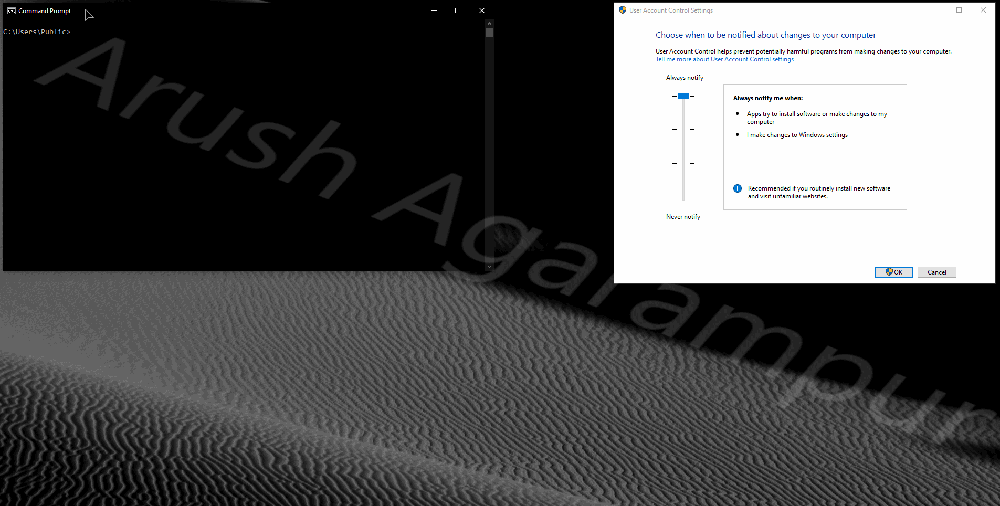

#

The fifth attack to bypass User Account Control (UAC) **at any level** and gain elevated (Administrator) privileges to run any program at a high integrity level.

## Requirements

 - Administrator account
 - **Any** UAC notification level, even Always Notify!
 - WLAN AutoConfig service running (most people don't need to worry about this)

## How it works
ByeIntegrity V uses a DLL hijack, like ByeIntegrity 1.0, environment variable, like ByeIntegrity 4.0, and something completely different — the Task Scheduler.

ByeIntegrity V uses the documented Task Scheduler COM interface to launch the `CDSSync` task located at `\Microsoft\Windows\WlanSvc` in the Task Scheduler library. ByeIntegrity V also modifies the `SystemRoot` environment variable for the current user to represent a custom WINDOWS folder. After setting the custom `SystemRoot` variable, the `CDSSync` task is started. This triggers the attack and launched `cmd.exe` running as an administrator, therefore bypassing UAC.

## How it was discovered
I really wanted to find a UAC bypass capable of bypassing even the highest UAC notification level, so I started by analyzing how elevated processes are created in the first place. What we call "Administrator" privileged processes are created by the Application Information (`appinfo`) service, specifically by the function `RAiLaunchAdminProcess` located in `appinfo.dll`. This function launches `consent.exe`, then proceeds to create the specified program with a custom token which includes the `BUILTIN\Administrators` group's status set to enabled, other groups, and privileges not available to standard users. This is what creates our so-called "Administrator" process.

The open-source tool Process Hacker can create elevated processes, but never causes a UAC prompt. How? I noticed that this was done by the Process Hacker service, running as `NT AUTHORITY\SYSTEM`. I began to think if such a mechanism existed on Windows by default, and the first thing that came to my mind was the Task Scheduler.

You can create tasks with the Task Scheduler and check a little checkbox that says "Run with highest privileges." If you specify a standard user account that is an Administrator, and select that checkbox, Task Scheduler creates the specified process running as an Administrator, without UAC prompting at all, just like Process Hacker! This is actually because the Application Information service is never used when we create Administrator processes like this, the Task Scheduler (and Process Hacker) does all the work creating the Administrator token all by itself, so UAC is never invoked.

Because UAC is never invoked, this means that we can effectively bypass UAC completely, regardless of its settings/notification level. But now I needed to figure out a way to actually do that.

The `CDSSync` task is truly a blessing for many reasons:

 - It's a task we can start without Administrator privileges
 - It runs as the current user account (INTERACTIVE)
 - It has the "Run with highest privileges" checkbox checked

The task is run from the module `WiFiCloudStore.dll`, and after some reverse engineering, we can see that it calls `CoCreateInstance(CLSID_CNetworkListManager, ...`. Now, the Network List Manager coclass has a proxy DLL, and its location is specified in the Registry as `%SystemRoot%\System32\npmproxy.dll`. Do you see the problem?

So all we need to do is set our own custom `SystemRoot` environment variable, place our fake `npmproxy.dll`, make sure the WLAN AutoConfig service is running (read the section towards the bottom), and then launch the `CDSSync` task. And bazinga! We've completely bypassed UAC, and we didn't even need to mess with anything except a single Registry key. Easy!

## UACMe
I presented this method to @hfiref0x, but after working with him, we found a problem that's pretty serious. On clean installs of Windows or machines that never connect to the internet, the WLAN AutoConfig service is set to `Demand start` and is not running. On all other machines, it is set to `Auto start`. Unfortunately, Administrator privileges are required to start the service, and we spent lots of time trying to get some other way to force the service to start. We could not find some way to make it start, and I even tried using the service in a user process itself, but that didn't work. In the end, we decided to not include it because it won't be good to have an attack that just works 80% of the time and is extremely version specific.

Here's a link to the GitHub issue: https://github.com/hfiref0x/UACME/issues/90

## Using the code
If you're reading this then you probably know how to compile the source. Just note that this hasn't been tested or designed with x86 in mind at all, and it probably won't work on x86 anyways.

Just like UACMe, **I will never upload compiled binaries to this repo.** There are always people who want the world to crash and burn, and I'm not going to provide an easy route for them to run this on somebody else's computer and cause intentional damage. I also don't want script-kiddies to use this attack without understanding what it does and the damage it can cause.

Make sure to compile the payload project as Release first in order to use it in the main ByeIntegrity executable.

The code is commented only where it's needed. Otherwise, the code is pretty much self-explanatory. You can visit the ByeIntegrity 4.0 repo to learn how environment variables with in the ByeIntegrity attacks.

## Supported versions
I've only developed and tested this attack on Windows 10 build 19042. I think it'll also work on 19041, but I haven't tested that. It may work on other previous versions if they have the `CDSSync` task, but I'm not sure. However, this attack should work for all future versions of Windows 10 as long as Microsoft hasn't changed/patched anything.

## What's the deal with the WLAN AutoConfig service?
Read: https://github.com/hfiref0x/UACME/issues/90

